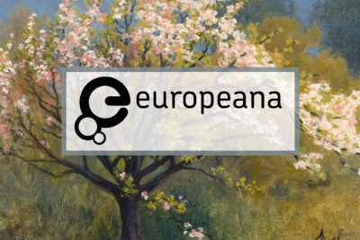
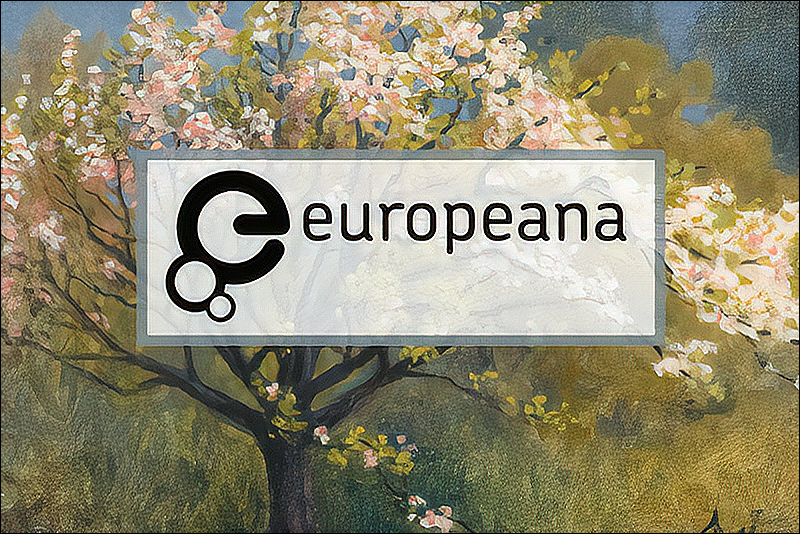
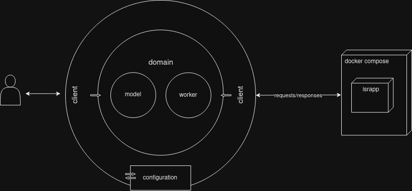

[](https://github.com/europeana/metis-image-enhancer/actions/workflows/ci.yml) [](https://sonarcloud.io/summary/new_code?id=europeana_metis-image-enhancer)

[](https://sonarcloud.io/summary/new_code?id=europeana_metis-image-enhancer) [](https://sonarcloud.io/summary/new_code?id=europeana_metis-image-enhancer)  
[](https://sonarcloud.io/summary/new_code?id=europeana_metis-image-enhancer) [](https://sonarcloud.io/summary/new_code?id=europeana_metis-image-enhancer)  
[](https://sonarcloud.io/summary/new_code?id=europeana_metis-image-enhancer) [](https://sonarcloud.io/summary/new_code?id=europeana_metis-image-enhancer)  
[](https://sonarcloud.io/summary/new_code?id=europeana_metis-image-enhancer)

# Metis image enhancer repository
## Table of Contents
- [Table of Contents](#table-of-contents)
- [About the Project](#about-the-project)
- [Description](#description)
- [Built With](#built-with)
- [Getting Started](#getting-started)
- [Prerequisites](#prerequisites-and-dependencies)
- [Installation](#installation-of-library)
- [Usage](#usage)
- [Example](#example)
- [Architecture](#design-architecture)
- [Roadmap](#roadmap)
- [Contributing](#contributing)
- [Acknowledgements](#acknowledgements)

# About the Project

# Description
Library that calls python api from java. The library uses image enhancement (super resolution)
on small thumbnails, and performs a simple sharpen filter.

# Built With
* [Python](https://www.python.org/)
* [Java](https://www.java.com)
* [Test containers](https://testcontainers.com/)
* [Junit](https://junit.org/junit5/)
* [Archunit](https://www.archunit.org/)

# Getting Started
# Prerequisites and Dependencies

* [Docker Engine v24.0.4](https://docs.docker.com/engine/)
* [Docker Compose v2.19.1](https://docs.docker.com/compose/)

# Installation of library
### Get the repository
```shell
git clone https://github.com/europeana/metis-image-enhancer.git
```

### Build docker ISR API
go to the cloned folder of the library /metis-image-enhancer/metis-image-enhancer-python-rest/src/main,
and run the following command to build the image enhancer application
```shell
docker compose build --no-cache
```

# Usage
#### Enable Python API Endpoint for image enhancement
go to the cloned folder of the library /metis-image-enhancer/metis-image-enhancer-python-rest/src/main, 
and run the following commands to get the service up and running 
this command will run with 1 node
```shell
docker compose up 
```
the application uses a python api to enhance the image

### 1. Image enhancement is possible with the command:
```shell
curl --request POST http://localhost:8080/enhance/image --form image=@./metis-image-enhancer-client/src/test/resources/img/thumbnail.jpg \ 
                                                        --output ./metis-image-enhancer-client/src/test/resources/img/thumbnail_enhanced.jpg
```
Response:
```
HTTP code: 200 
Content-Type: image/jpeg
Response Body: Enhanced image to download
``` 

### 2. Client java library
Note: Java and Maven are prerequisites, the client adds sharpen filter extra to the python api result to improve the
end result.

#### installation
```shell
mvn clean install
```

#### usage
add dependency in your project
````xml
<dependency>
    <groupId>eu.europeana.metis.image.enhancement</groupId>
    <artifactId>metis-image-enhancer-client</artifactId>
    <version>1</version>
</dependency>
````
### properties
By default, the following properties are set in the library if you want to change the address or port, and the timeout 
are in seconds.
```
api.url = http://localhost:8080
connect.timeout = 300
read.timeout = 300
```
#### command line stand alone script
If you only want to use the image processing without the API, you can invoke this 
from the command line, using the script directly.

```
python ./metis-image-enhancer-python-rest/src/main/mie.py -i image_input.jpg -o image_output.jpg
```


## General limitations 
Why this AI python model runs as a script? in this iteration the python model cannot be held 
in memory otherwise you will get an Out of Memory. The model in python of image processing 
doesn't free the resources every time. 
Steps of usage: load,  process, get results, discard, repeat again.

#### See demo project
run docker image previous to execute the demo app and then execute the following command in the cloned folder of 
the /metis-image-enhancer/metis-image-enhancer-demo
```shell
mvn clean package
```
execute the app e.g.
``` 
java -jar ./target/metis-image-enhancer-demo-1-SNAPSHOT.jar
```
example of demo code can be found in the metis-image-enhancer-demo module.

# Example
The following image shows the outcome:
## Original

## Enhanced


# Design architecture


The motivation behind the design summarizes in the following concept:
"Communication goes from outer layers to the inner layers."

- The client layer contains interactions details between the configuration and the domain.
- The configuration layer provides the properties needed to connect with the isr app.
- The domain layer uses the adapter pattern implementation to plug in any client adapter implementation 
  to do the image enhancement. It contains the model and worker core business logic, so this remains untouched 
  by external changes of the outer layers as much as possible.

# Roadmap
- [x] library initial release.
- [x] restructure to metis style projects.
- [x] use stream of bytes instead of file.
- [ ] ...

# Contributing
Any contributions you make are appreciated.

1. Fork the Project
2. Create your Feature Branch (git checkout -b feature/AmazingFeature)
3. Commit your Changes (git commit -m 'Add some AmazingFeature')
4. Push to the Branch (git push origin feature/AmazingFeature)
5. Open a Pull Request

# Acknoledgements
This project is powered by
[Image Super Resolution v2.2.0](https://github.com/idealo/image-super-resolution)
